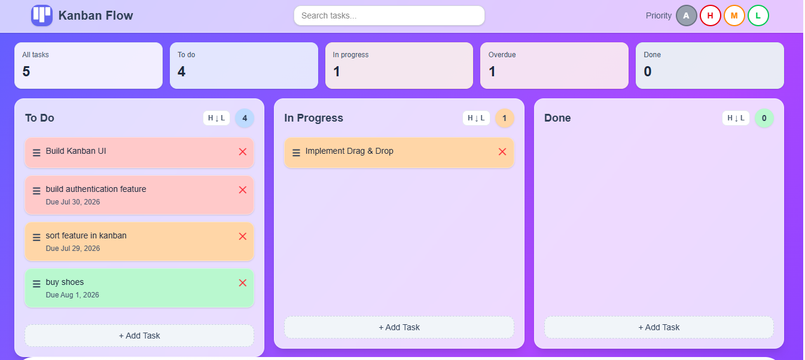

# 🚀 Smart Kanban

An AI-powered Kanban board built with **React, Express, Tailwind CSS, and Google Gemini AI** that helps users organize tasks, prioritize work, and improve productivity through intelligent task analysis.

---


## ✨ Features

### 📋 Task Management
- Create, edit, and delete tasks
- Drag & drop tasks across columns
- Priority labels (High, Medium, Low)
- Search tasks instantly
- Filter tasks by priority
- Local storage persistence
- Responsive user interface

### 🤖 AI Workspace
- 🎯 Suggest task priority
- 📋 Break complex tasks into actionable steps
- 📝 Generate board summaries
- 💪 Productivity coaching
- 💬 AI-powered Kanban chat assistant

### 📊 Dashboard
- Task statistics
- Progress overview
- Clean and modern UI
- Responsive layout

---

## 🛠 Tech Stack

### Frontend
- React
- Vite
- Tailwind CSS
- JavaScript (ES6+)

### Backend
- Node.js
- Express.js

### AI
- Google Gemini API

### Deployment
- Frontend: Vercel *(Coming Soon)*
- Backend: Render *(Coming Soon)*

---

## 📂 Project Structure

```text
smart-kanban
│
├── public/
├── server/
│   └── server.js
│
├── src/
│   ├── assets/
│   ├── components/
│   ├── services/
│   ├── App.jsx
│   └── main.jsx
│
├── package.json
├── tailwind.config.js
└── README.md
```

---

## 🤖 AI Features

The AI assistant understands your current Kanban board and can:

- Analyze task priority
- Break tasks into implementation steps
- Summarize project progress
- Identify risks
- Suggest next actions
- Answer project-related questions
- Provide productivity guidance

The backend securely communicates with the Google Gemini API, ensuring the API key is never exposed to the client.

---

## 📸 Screenshots

### Dashboard



---

### AI Workspace


---

### AI Chat Assistant


---

### Board Summary


---

## ⚙️ Installation

### Clone the repository

```bash
git clone https://github.com/KeerthyHQ/smart-kanban.git
cd smart-kanban
```

### Install dependencies

```bash
npm install
```

### Start the frontend

```bash
npm run dev
```

### Start the backend

```bash
node server/server.js
```

---

## 🔑 Environment Variables

Create a `.env` file inside the project root.

```env
PORT=3001
GEMINI_API_KEY=YOUR_API_KEY
GEMINI_MODEL=gemini-flash-latest
```

---

## 💡 How It Works

```text
React Frontend
      │
      ▼
Express Backend
      │
      ▼
Google Gemini API
```

The frontend sends AI requests to the Express backend.

The backend securely calls the Gemini API and returns AI-generated responses.

---

## 🚀 Future Enhancements

- User Authentication
- Cloud Database
- Team Collaboration
- Due Dates & Reminders
- Activity History
- Dark Mode
- Analytics Dashboard
- Export & Import Boards

---

## 📚 Key Concepts Practiced

- React Components
- React Hooks
- State Management
- Drag & Drop UI
- REST APIs
- Express.js
- AI Integration
- Prompt Engineering
- Environment Variables
- Responsive Design
- Local Storage
- Component Architecture

---

## 👨‍💻 Author

**Keerthika M**

GitHub: [KeerthyHQ](https://github.com/KeerthyHQ)

LinkedIn: [Keerthika M](https://www.linkedin.com/in/keerthika-m-3b51b9127/)

---

## ⭐ Support

If you found this project useful, consider giving it a ⭐ on GitHub.